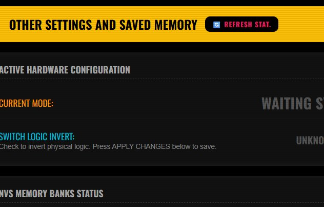
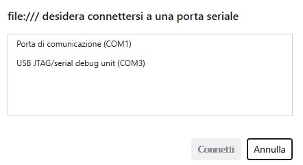
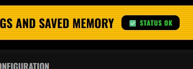
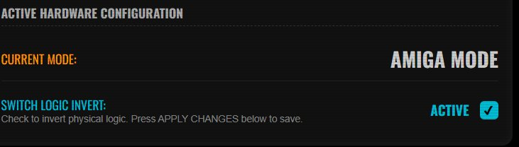

# 🚀 Getting Started — USB2C64 Advanced Edition

This guide walks you through flashing the firmware, verifying the connection, and configuring your first controller.  
For troubleshooting, see [TROUBLESHOOTING.md](TROUBLESHOOTING.md).  
For advanced diagnostics and developer tools, see [DEVELOPER.md](DEVELOPER.md).

---

## 1. Flashing the Firmware

> Skip this section if your board already has the firmware installed.

### What you need

- The USB2C64 board
- A USB-C cable
- Google Chrome (required — Firefox does not support WebSerial or WebHID)
- The precompiled `.bin` file from the [Releases](../../releases) page

### Option A — Web Flasher (recommended, no installation required)

1. **Disconnect the adapter from the C64/Amiga** — never flash while connected to the computer.
2. Hold the **BOOT** button on the ESP32, connect the board via USB-C to your PC, wait one second, then release the button.
3. Open the [esptool web flasher](https://espressif.github.io/esptool-js/) in Chrome and click **Connect**.
4. Set the Flash Address to `0x0000` and upload the `.bin` file.
5. Once complete, disconnect and reconnect the board normally (no BOOT button needed).

### Option B — Command Line (esptool)

```bash
pip install esptool
esptool.py -b 921600 -c esp32s3 -p <PORT> write_flash --flash_freq 80m 0x00000 USBtoC64_Adv.bin
```

Replace `<PORT>` with your board's serial port (e.g. `COM3` on Windows, `/dev/ttyUSB0` on Linux/macOS).

### Option C — Compile from source (Arduino IDE)

1. Install the **ESP32S3 Dev Module** board package in Arduino IDE.
2. Install the [ESP32_USB_Host_HID](https://github.com/esp32beans/ESP32_USB_Host_HID) library via `Sketch → Include Library → Add .ZIP Library`.
3. Open `USBtoC64_Adv.ino` and click **Upload**.

---

## 2. Verifying the Connection

Once flashed, you can verify that the adapter is running and responsive directly from the browser — no serial terminal needed.

1. Connect the USB2C64 to your PC via USB-C.
2. Open the [web configurator hub](https://raw.githack.com/jajpohke/USBtoC64_AMI_CFG_Adv/main/configurator/index.html) in Chrome.
3. Navigate to **Settings** (`memory.html`).

You will see the **OTHER SETTINGS AND SAVED MEMORY** panel with a **REFRESH STAT.** button:



4. Click **REFRESH STAT.** — Chrome will ask you to select a serial port:



Select the port that corresponds to your USB2C64. If you are unsure which one it is, it will typically appear as **USB JTAG/serial debug unit** or similar. Avoid selecting generic COM ports like COM1.

5. After connecting, the button turns green and shows **STATUS OK**:



6. The **ACTIVE HARDWARE CONFIGURATION** panel below will now show the current mode and switch state:



The connection is working correctly. From this point on, the configurator pages will communicate with the adapter automatically.

---

## 3. Selecting C64 or Amiga Mode

The adapter needs to know which computer it is connected to. There are two ways to set the mode:

### Physical switch (hardware)

The board has a small slide switch that selects between **C64** and **Amiga** mode. Set it before connecting the adapter to the computer. Changing the switch while the adapter is powered will trigger an automatic reboot into the new mode.

### Web interface

In the **Settings** page (`memory.html`), under **ACTIVE HARDWARE CONFIGURATION**, you will see the current mode and a **SWITCH LOGIC INVERT** checkbox. Enabling this inverts the physical switch logic — useful if your board has the switch wired in reverse, or if you want to override the default behaviour without opening the case. Press **APPLY CHANGES** to save.

> The mode shown in the web interface always reflects the actual hardware state after a successful **REFRESH STAT.** connection.

---

## 4. Configuring a Controller

Open [`configurator.html`](https://raw.githack.com/jajpohke/USBtoC64_AMI_CFG_Adv/main/configurator/configurator.html) from the hub.

### How it works

The configurator uses both **WebHID** (raw USB data) and the **Gamepad API** to detect your controller's inputs and let you map them visually to C64/Amiga outputs.

### Connection flow

The configurator uses a three-step indicator at the top of the page:

- 🔴 **Red** — "Press any button on your pad to initialize..." — plug in your controller and press any button
- 🟡 **Yellow** — "Pad detected: [name] — Click here to start → 🔌 Connect HID" — click the banner to open the WebHID connection
- 🟢 **Green** — "ONLINE: [pad name]" — the controller is live and ready to map

### Mapping buttons

The page shows a visual layout of the joystick zones (directions, fire buttons, diagonals, shoulder buttons, etc.).

- **Directional zones** (UP / DOWN / LEFT / RIGHT and diagonals): press the corresponding direction on your controller. The configurator will detect whether it is an analogue axis or a digital button and assign it accordingly.
- **Fire / action zones** (FIRE, FIRE2, FIRE3, etc.): press the button you want to assign. Each click cycles through the available actions: `F1 → UP → F2 → A-HLD → F3 → A-OFF → A-TOG`.
- **Force Axis** checkbox (default: checked): forces directional zones to use axis index (`[IDX:]`) even if the Gamepad API reports them as buttons. Useful for SNES-style pads.

Once all zones are mapped as desired, click **💾 SAVE**. The mapping is written to NVS on the ESP32 and will be active on every subsequent boot — no recompile required.

### Pre-configured profiles

If your controller is in the [supported list](SUPPORTED_PADS.md), it will be recognised automatically without any manual mapping needed. The saved NVS mapping (if present) always takes priority over the built-in profile.

---

## 5. What's Next

- Customise LED colors → [`led.html`](https://raw.githack.com/jajpohke/USBtoC64_AMI_CFG_Adv/main/configurator/led.html)
- Adjust mouse speed and mode → [`mouse.html`](https://raw.githack.com/jajpohke/USBtoC64_AMI_CFG_Adv/main/configurator/mouse.html)
- Check NVS memory usage or factory reset → [`memory.html`](https://raw.githack.com/jajpohke/USBtoC64_AMI_CFG_Adv/main/configurator/memory.html)
- Advanced diagnostics and serial commands → [DEVELOPER.md](DEVELOPER.md)
